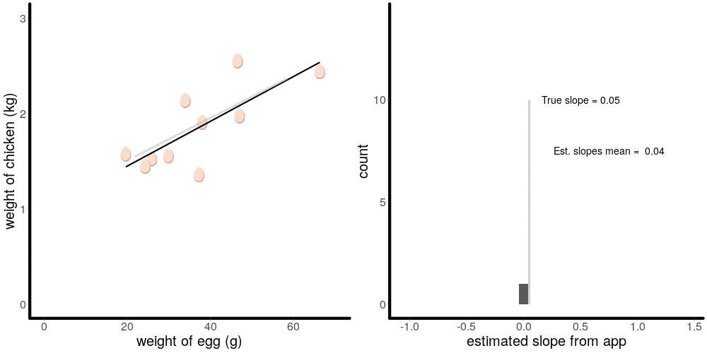
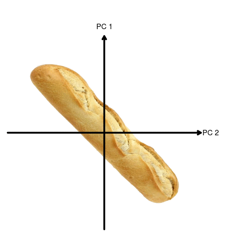
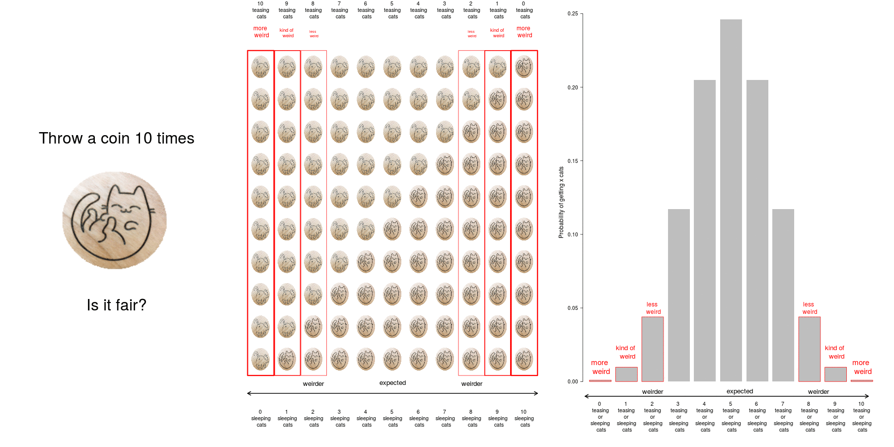
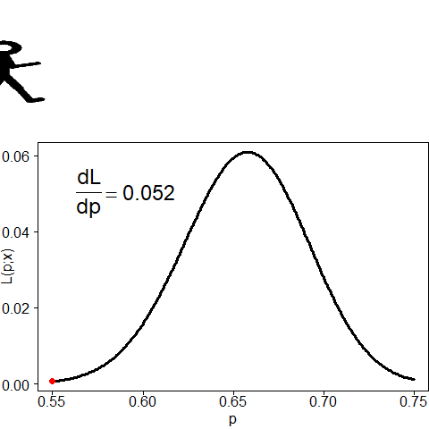

# Overview

[I](https://cmjt.github.io/) spend my time teaching stats, coding—then fixing—bugs, pandering to my pets, and making gin. This repo contains

 - [`R` scripts](https://github.com/cmjt/statbiscuits/tree/master/r_scripts) to make stats related [.gifs](https://github.com/cmjt/statbiscuits/tree/master/figs_n_gifs)
 - [**s**tatbiscuits **wor**ksheet**s**](https://cmjt.github.io/statbiscuits/) that go hand in hand with courses I teach (see [source code here](https://github.com/cmjt/statbiscuits/tree/master/swots))
 - [source code](https://github.com/cmjt/statbiscuits/tree/master/probable) for a simple RShiny application that allows students to explore the shapes of probability distributions: [probable](https://cmjt.shinyapps.io/probable)

Feel free to fork and modify for your own use or just download the gifs :-)

# Selection of GIFs

## Linear models & line of best fit

This works in conjunction with a Google Apps Script I made that allows students to draw their best line of fit online (mouseclicks only) and submit it to a shared Google Sheet. The `R` script then pulls all the start and end points of their drawn lines and creates a gif showing the distribution of all their estimates.

*[Code for this Google Script App can be found here](https://script.google.com/d/1hFga6ECOLzPkw45KY5LHGYj-VGaMtWh5d1n9cV5y3RhOk1G2dGNlpJct/edit?usp=sharing) and the [exported line ends are available here](https://docs.google.com/spreadsheets/d/1vn7oGtw06KJazYx-F2nReFvoeqONrskNehGkJpeugXw/edit?usp=sharing)*

*[`R` side code can be found here](https://github.com/cmjt/statbiscuits/blob/master/r_scripts/app_lm_plot.r)*

## Principal component analysis

*[`R`script can be found here](https://github.com/cmjt/statbiscuits/blob/master/r_scripts/pca.r)*

## Hypothesis testing (coin flip)

*[`R`script can be found here](https://github.com/cmjt/statbiscuits/blob/master/r_scripts/weird_coin.r)*

## Maximum likelihood (binomial example)

*[`R`script can be found here](https://github.com/cmjt/statbiscuits/blob/master/r_scripts/mle.r)*

## Illustrating things I found a few students struggled with...

### Distribution shape as sample size increases and variance

*[`R`script can be found here](https://github.com/cmjt/statbiscuits/blob/master/r_scripts/hist.r)*

*[`R`script can be found here](https://github.com/cmjt/statbiscuits/blob/master/r_scripts/var.r)*

### The p..(), d..(), q..(), r..() functions in `R`

*[`R`script can be found here](https://github.com/cmjt/statbiscuits/blob/master/r_scripts/pdqr.r)*

### The difference between conditioning and intersection

*[`R`script can be found here](https://github.com/cmjt/statbiscuits/blob/master/r_scripts/conditional_vs_intersection.r)*