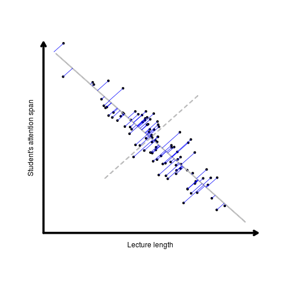
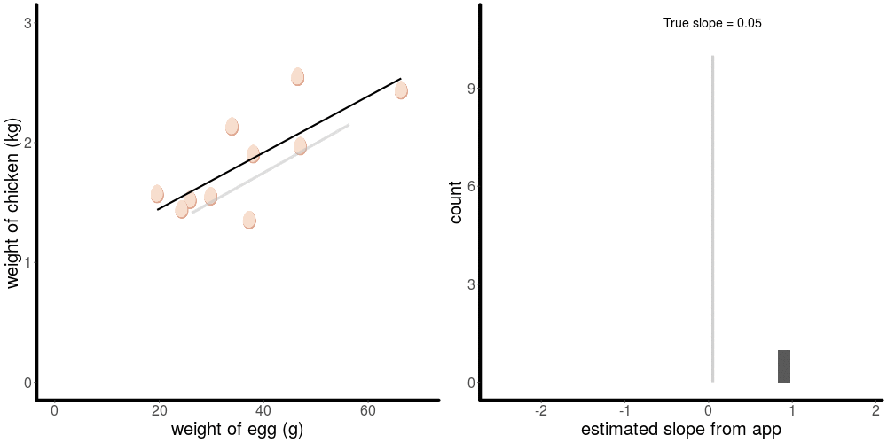
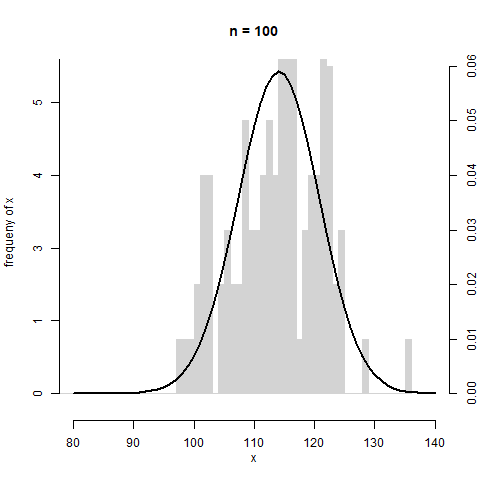
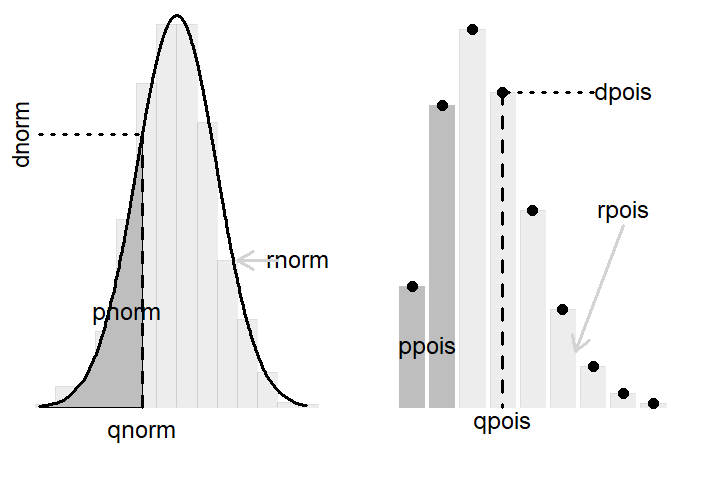
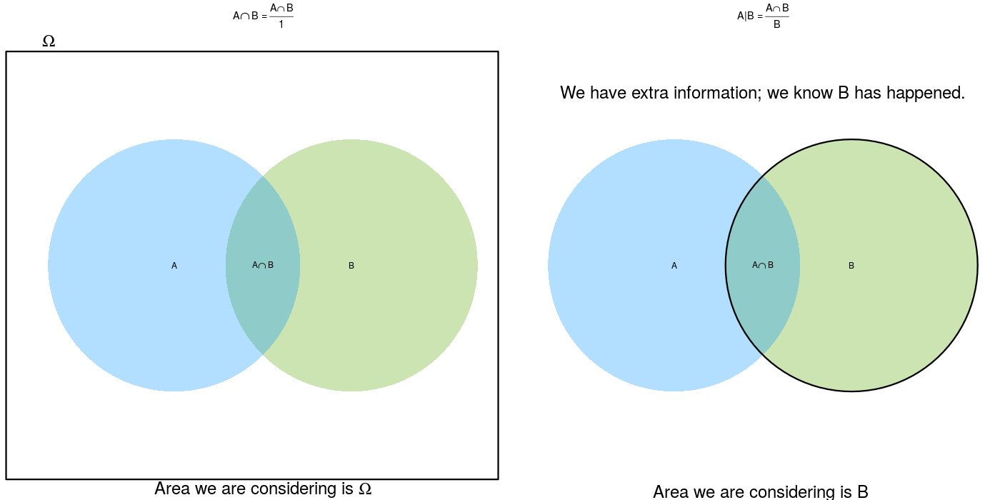

## Overview

This repo contains `R` scripts to illustrate some fundamental statistical concepts (e.g., maximum likelihood, pca, hypothesis testing & more). These are meant to supplement classroom materials only and on occasion go hand in hand with specific examples from the STATS210 course (Statistical Theory) at the University of Auckland.

Feel free to fork and modify for your own use or just download the gifs :-)

## Examples

### Principal component analysis

### Hypothesis testing (coin flip)

### Linear models & line of best fit

This works in conjunction with a Google Apps Script I made that allows students to draw their best line of fit online (mouseclicks only) and submit it to a shared Google Sheet. The `R` script then pulls all the start and end points of their drawn lines and creates a gif shouing the distribution of all their estimates

<iframe src="https://www.appsheet.com/preview/b3756bde-b741-4609-bf7d-e2eee77852d6" width="320" height="568"/>

### Maximum likelihood (binomial example)

### Illustrating things I found a few students struggled with...

#### Distribution shape as sample size increases and variance

#### The p..(), d..(), q..(), r..() functions in `R`

#### The difference between conditioning and intersection

