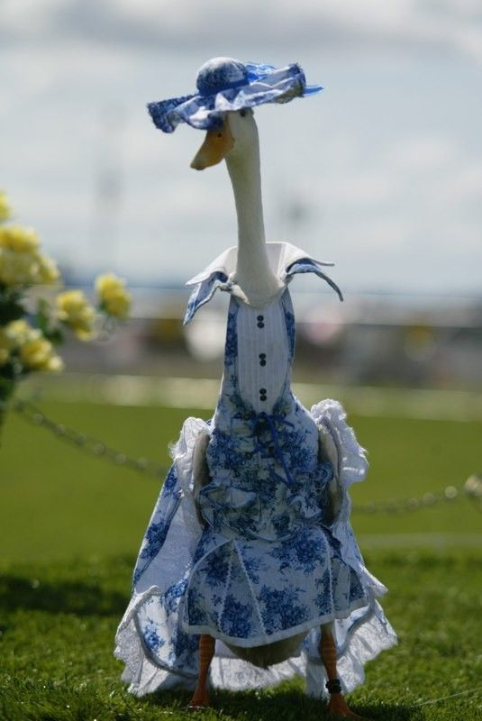

The Data
--------

### Duck outfits

*Use the drop-down menu to explore the collection of duck outfits.*

<!--html_preserve-->
<html>
<select id="AterKEmhNk" class="selectpicker" data-dropdown-align-right="false" data-dropup-auto="true" data-header="false" data-live-search="true" data-live-search-style="contains" data-show-tick="true" data-width="false" data-size="10"><option value="images/blue_flowers-1.jpeg">blue\_flowers-1</option>
<option value="images/blue_flowers-2.jpg" selected>blue\_flowers-2</option>
<option value="images/blue_flowers-3.jpeg">blue\_flowers-3</option>
<option value="images/blue_flowers-4.jpeg">blue\_flowers-4</option>
<option value="images/blue_flowers-5.jpeg">blue\_flowers-5</option>
<option value="images/bridal-1.jpg">bridal-1</option>
<option value="images/bridal-2.jpeg">bridal-2</option>
<option value="images/bridal-3.jpg">bridal-3</option>
<option value="images/bridal-4.jpg">bridal-4</option>
<option value="images/bridal-5.jpeg">bridal-5</option>
<option value="images/bridal-6.jpg">bridal-6</option>
<option value="images/bridal-7.jpg">bridal-7</option>
<option value="images/patterns-1.jpg">patterns-1</option>
<option value="images/patterns-2.jpg">patterns-2</option>
<option value="images/patterns-3.jpg">patterns-3</option>
<option value="images/patterns-4.jpeg">patterns-4</option>
<option value="images/pink_check-1.jpg">pink\_check-1</option>
<option value="images/pink_check-2.jpg">pink\_check-2</option>
<option value="images/pink_check-3.jpeg">pink\_check-3</option>
<option value="images/pink_check-4.jpeg">pink\_check-4</option>
<option value="images/red-1.jpeg">red-1</option>
<option value="images/red-2.jpeg">red-2</option>
<option value="images/red-3.jpeg">red-3</option>
<option value="images/red-4.jpeg">red-4</option>
<option value="images/red-5.jpg">red-5</option>
<option value="images/red-6.jpeg">red-6</option>
<option value="images/wax_jacket-1.jpg">wax\_jacket-1</option>
<option value="images/wax_jacket-2.jpeg">wax\_jacket-2</option>
<option value="images/wax_jacket-3.jpg">wax\_jacket-3</option></select>

</html>

<!--/html_preserve-->
All images used here are available
[here](https://github.com/cmjt/statbiscuits/tree/master/cluster_ducks/images).
To read images into R you can use the `readJPEG()` function from the `R`
package `jpeg`. Using `readJPEG` each image is read in as a
*m* \* *n* \* 3 array, where each of the three *m* \* *n* matricies are
the red, green, and blue primary values (R, G, & B values) of each pixel
respectivly.

### RGB arrays

For ease, however, we’re going to download the RGB data directly from
GitHub.

    data_url <- "https://github.com/cmjt/statbiscuits/raw/master/cluster_ducks/duck_rgbs.RData"
    load(url(data_url))

The `duck_rgbs` object is a named list of RGB arrays for each image.
There are 29 different images of 6 different outfits.

    length(duck_rgbs)
    ## [1] 29
    names(duck_rgbs)
    ##  [1] "blue_flowers-1" "blue_flowers-2" "blue_flowers-3" "blue_flowers-4"
    ##  [5] "blue_flowers-5" "bridal-1"       "bridal-2"       "bridal-3"      
    ##  [9] "bridal-4"       "bridal-5"       "bridal-6"       "bridal-7"      
    ## [13] "patterns-1"     "patterns-2"     "patterns-3"     "patterns-4"    
    ## [17] "pink_check-1"   "pink_check-2"   "pink_check-3"   "pink_check-4"  
    ## [21] "red-1"          "red-2"          "red-3"          "red-4"         
    ## [25] "red-5"          "red-6"          "wax_jacket-1"   "wax_jacket-2"  
    ## [29] "wax_jacket-3"

### Data exploration

Let’s summarise each image by the average R, G, and B value
respectively.

    cluster_ducks <- data.frame(attire  = stringr::str_match(names(duck_rgbs),"(.*?)-")[,2],
                                av_red = sapply(duck_rgbs, function(x) mean(c(x[,,1]))),
                                av_green = sapply(duck_rgbs, function(x) mean(c(x[,,2]))),
                                av_blue = sapply(duck_rgbs, function(x) mean(c(x[,,3]))))

    head(cluster_ducks)
    ##                      attire    av_red  av_green   av_blue
    ## blue_flowers-1 blue_flowers 0.4529505 0.4790429 0.4610547
    ## blue_flowers-2 blue_flowers 0.4751319 0.5131624 0.4977116
    ## blue_flowers-3 blue_flowers 0.4560981 0.4881459 0.4919892
    ## blue_flowers-4 blue_flowers 0.4745254 0.5117347 0.4948642
    ## blue_flowers-5 blue_flowers 0.5955183 0.6413420 0.5757063
    ## bridal-1             bridal 0.5718594 0.5645125 0.4567448
    table(cluster_ducks$attire)
    ## 
    ## blue_flowers       bridal     patterns   pink_check          red   wax_jacket 
    ##            5            7            4            4            6            3

    library(plotly) ## for 3D interactive plots

    plot_ly(x = cluster_ducks$av_red, y = cluster_ducks$av_green, 
            z = cluster_ducks$av_blue,
            type = "scatter3d", mode = "markers", 
            color = cluster_ducks$attire)

<!--html_preserve-->

<!--/html_preserve-->

3D scatterplot of the average RGB value per image.

Rather than the average R, G, & B let’s calculate the proportion of each
primary.

    prop.max <- function(x){
        ## matrix of index of max RGB values of x
        mat_max <- apply(x,c(1,2),which.max)
        ## table of collapsed values
        tab <- table(c(mat_max))
        ## proportion of red
        prop_red <- tab[1]/sum(tab)
        prop_green <- tab[2]/sum(tab)
        prop_blue <- tab[3]/sum(tab)
        return(c(prop_red,prop_green,prop_blue))
    }
    ## proportion of r, g, b in each image
    prop <- do.call('rbind',lapply(duck_rgbs,prop.max))
    cluster_ducks$prop_red <- prop[,1]
    cluster_ducks$prop_green <- prop[,2]
    cluster_ducks$prop_blue <- prop[,3]

    plot_ly(x = cluster_ducks$prop_red, y = cluster_ducks$prop_green, 
            z = cluster_ducks$prop_blue,
            type = "scatter3d", mode = "markers", 
            color = cluster_ducks$attire)

<!--html_preserve-->

<!--/html_preserve-->

3D scatterplot of the proportion of RGB value per image.

K means clustering
------------------

Can we cluster the images based on the calculated measures above?

    ## library for k-means clustering
    library(factoextra)
    ## re format data. We deal only with the numerics info
    df <- cluster_ducks[,2:7]
    ## specify rownames as image names
    rownames(df) <- names(duck_rgbs)

    distance <- get_dist(df)
    fviz_dist(distance, gradient = list(low = "#00AFBB", mid = "white", high = "#FC4E07"))

### Compute k-means

So we have an idea there are 6… but is there enough information in the
noisy images?

Setting `nstart = 25` means that `R` will try 25 different random
starting assignments and then select the best results corresponding to
the one with the lowest within cluster variation.

    ## from two clusters to 6 (can we separate out the images?)
    set.seed(4321)
    k2 <- kmeans(df, centers = 2, nstart = 25)
    k3 <- kmeans(df, centers = 3, nstart = 25)
    k4 <- kmeans(df, centers = 4, nstart = 25)
    k5 <- kmeans(df, centers = 5, nstart = 25)
    k6 <- kmeans(df, centers = 6, nstart = 25)

#### Results of a call to `kmeans()`

The `kmeans()` function returns a list of components:

-   `cluster`, integers indicating the cluster to which each observation
    is allocated
-   `centers`, a matrix of cluster centers/means
-   `totss`, the total sum of squares
-   `withinss`, within-cluster sum of squares, one component per cluster
-   `tot.withinss`, total within-cluster sum of squares
-   `betweenss`, between-cluster sum of squares
-   `size`, number of observations in each cluster

<!-- -->

    k2$tot.withinss
    ## [1] 2.786543
    k3$tot.withinss
    ## [1] 1.75652
    k4$tot.withinss
    ## [1] 1.193151
    k5$tot.withinss
    ## [1] 0.9316645
    k6$tot.withinss
    ## [1] 0.7281481

    barplot(c(k2$tot.withinss,k3$tot.withinss,k4$tot.withinss,
              k5$tot.withinss,k6$tot.withinss),
            names = paste(2:6," clusters"))

#### Vizualising `kmeans()`

    p2 <- fviz_cluster(k2, data = df)
    p3 <- fviz_cluster(k3, data = df)
    p4 <- fviz_cluster(k4, data = df)
    p5 <- fviz_cluster(k5, data = df)
    p6 <- fviz_cluster(k6, data = df)
    ## for arranging plots
    library(patchwork) 
    p2/ p3/ p4/ p5/ p6

### How many clusters are best?

The `fviz_nbclust()` function in the `R` package `factoextra` can be
used to compute the three different methods \[elbow, silhouette and gap
statistic\] for any partitioning clustering methods \[K-means, K-medoids
(PAM), CLARA, HCUT\].

    # Elbow method
    fviz_nbclust(df, kmeans, method = "wss") +
      labs(subtitle = "Elbow method")

    # Silhouette method
    fviz_nbclust(df, kmeans, method = "silhouette")+
      labs(subtitle = "Silhouette method")

    # Gap statistic
    # recommended value: nboot= 500 for your analysis.
    set.seed(123)
    fviz_nbclust(df, kmeans, nstart = 25,  method = "gap_stat", nboot = 50)+
      labs(subtitle = "Gap statistic method")

